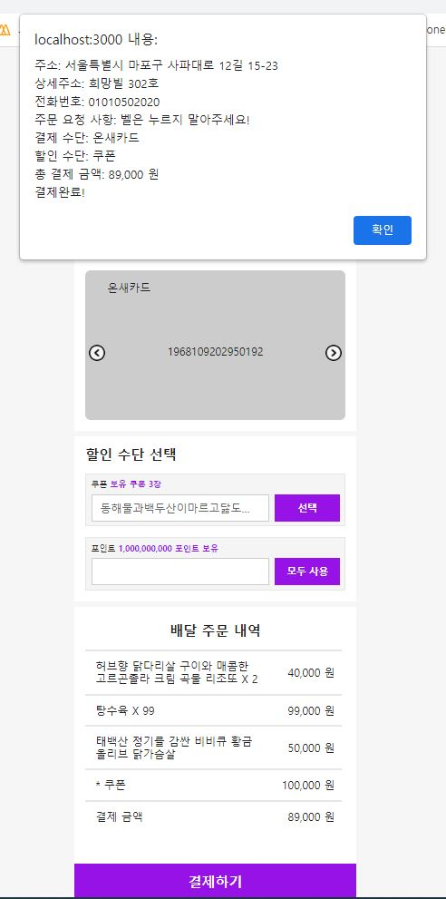

# Order App : 배달 앱 주문페이지 구현

리액트를 사용하여 진행한 첫 프로젝트입니다.
</br>
현업에 종사하는 선배의 도움을 구하여, 사용자의 요구사항 및 Figma를 전달 받아 배달 앱의 주문페이지 부분을 구현하였으며, 각 브랜치 별로 pull request를 요청해 피드백을 받아 저의 프론트엔드 개발에 대해 부족한 점을 보완하고 한층 성장할 수 있었던 계기가 된 프로젝트입니다.

</br>
</br>

## 1. 개발 목표

- 주어진 사용자의 요구사항에 충족하고, Figma에 맞게 프론트엔드 개발 구현

</br>
</br>

## 2. 사용 기술 및 배포

### 2.1 사용 기술

- JavaScript
- React
- Styled-Components
- Rest API
- Context API

### 2.2 배포

- Demo : https://youyou94.github.io/order-app/

</br>
</br>

## 3. 주요 기능

- 주문자 상세 주소 및 전화번호 변경
- 주문 요청 사항 선택
- 주문 요청 사항 직접 입력
- 결제 수단 선택
- 할인 수단 쿠폰 선택
- 할인 수단 포인트 사용
- 결제하기

</br>
</br>

## 4. 주요 개발 내용

- 공통 컴포넌트

  - Figma를 통해 재사용이 가능한 컴포넌트 유무 체크
  - Button, Label, Input 등 비슷한 ui 및 재사용이 가능한 공통의 컴포넌트 구현

- 비동기적 프로그래밍

  - 주어진 API 명세서를 이용하여 요청에 따라 API를 호출하여 사용자 정보 및 쿠폰 데이터 전달 - [사용한 API](https://github.com/grapgrap/homework-api)
  - `async/await`를 사용하여 비동기 처리

- 전역 상태 관리를 이용한 props 전달

  - 상위 컴포넌트에서 하위 컴포넌트의 깊이가 깊어질수록 생길 수 있는 `props drilling`의 문제를 방지하기 위해 전역 상태 관리 라이브러리인 `Context API` 사용

- 유효성 검사

  - 포인트 컴포넌트에 대한 유효성 검사 진행
  - 숫자만 입력, 입력 포인트가 보유 포인트보다 적게, 보유 포인트가 결제 금액보다 적게

- 협업 경험
  - 섹션 별로 각각의 브랜치를 나누어 pull request 요청 - [브랜치 별 PR 링크](https://github.com/YouYou94/order-app/pulls?q=is%3Apr+is%3Aclosed)
  - 해당 코드에 대하여 피드백을 받아 코드에 관하여 부족한 부분을 보완(코드의 중복, 컴포넌트 작성 방식)
  - Figma에 구현된 ui와 동일하게 구현을 할 수 있도록 CSS 기술 피드백을 받고 보완

</br>
</br>

## 5. 이슈 해결

- 브라우저 새로고침 시 `useState` 를 통해 관리하던 데이터가 초기 값인 `undefined` 상태가 되어 브라우저에 사용자의 데이터가 없어 오류로 인해 페이지가 렌더링되지 않는 문제를 겪었습니다.
  </br>
  문제가 생긴 이유는, **초기에 로컬 서버 API 연동을 통해 비동기적으로 데이터를 받아오기 때문에** 브라우저가 새로고침되면 사용 중인 값이 아직 데이터를 받지 못해 초기 값인 undefined 값을 가지기 때문에 생긴 오류인 것을 알게 되었습니다.
  </br>
  이와 같은 문제를 해결하기 위해 **조건부 렌더링**을 사용하여 비동기 처리가 끝난 이후 데이터가 들어올 경우 페이지를 렌더링하는 방식으로 코드를 바꿔 문제를 해결하였습니다.
  </br>
  (22. 12. 26) 또한, 서버가 연결되지 않았을 경우를 대비하여 기본 사용자 정보를 하드코딩해서 추가하여 또 다른 오류가 생기는 것을 방지하고, 서버가 연결되지 않아도 페이지가 렌더링될 수 있도록 변경하였습니다.

</br>
</br>

## 📁 폴더 구조

```
order-app
├─ 📁 src
│  ├─ 📁 assets
│  ├─ 📁 components
│  │  ├─ 📁 common
│  │  ├─ 📁 custom
│  │  ├─ 📁 Discount
│  │  ├─ 📁 Orderer
│  │  ├─ 📁 OrderHistory
│  │  ├─ 📁 PaymentMethod
│  │  └─ index.jsx
│  ├─ 📁 pages
│  └─ 📁 router
├─ App.css
├─ App.jsx
├─ Constants.jsx
└─ index.jsx

```

</br>
</br>

## UI 화면 구성

전체 화면

- 로컬 서버 연동 시 사용자 데이터

&nbsp; &nbsp; &nbsp; &nbsp; &nbsp; &nbsp;

- 로컬 서버 미 연동 시 사용자 데이터

&nbsp; &nbsp; &nbsp; &nbsp; &nbsp; &nbsp;

주문요청사항

- 직접 입력 선택 시

  &nbsp;

할인수단선택

- 쿠폰 선택 메뉴

  &nbsp;

- 쿠폰 사용

  &nbsp;

- 포인트 사용

  &nbsp;

결제하기

- 결제하기 버튼 클릭 시

  &nbsp;
